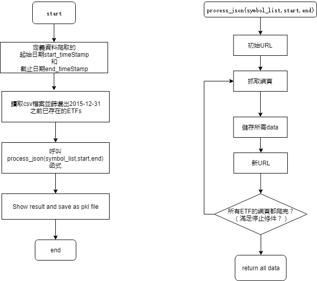

# crawler

In code **web_crawler_ETFs**, I crawl some information of ETFs (daily closing price and corresponding date) from website https://finance.yahoo.com/.

The code is written in [Python3](https://www.python.org) with [jupyter notebook](https://jupyter.org/).


## Installation
Download the repository
```bash
$ git clone https://github.com/EvaXunHsu/Fintect-Course.git 
```


## Modules
We use 
- **_datetime_** , **_time_** : 對時間做處理
- **_pytz_** : 因為ETFs的資料所對應的時區是EST，所以我的程式有考慮時區，使用了pytz
- **_json_** : request後，對JSON資料進行解碼，轉換為 Python 字典，便於操作資料
- **_pickle_** : 壓縮/保存/提取文件的模塊


## Packages
We use  
- **_requests_** ：它是一個Python HTTP庫，可使HTTP請求更簡單。
- **_pandas_** : 可以快速操作及分析資料；在本程式中用到了讀取檔案，資料篩選與合併等功能。


## Flow chart



## Issues
- 1.程式中用到 **_requests_** 和 **_pandas_** 套件，未安裝者在你的終端運行命令
 --**_pip install requests_**
 --**_pip install pandas_**
 即可

- 2.如果你還沒有安裝pip，或者不確定自己是否已安裝pip，http://www.runoob.com/w3cnote/python-pip-install-usage.html 可以幫助你完成這一流程。

- 3.如果你的環境中同時有python2和python3：
在執行檔案以及安裝packages時可能會遇到 **_python2和python3共存以及pip共存問題_** 導致失敗。
可參考 https://blog.csdn.net/autista/article/details/73650943 解決你的問題。

- 4.如果無法打開或編輯下載下來的.ipynb檔案，你可以參考 https://www.zhihu.com/question/45498930 解決你的問題。

- 5.如果你想要使用Git命令从GitHub上下載source code，先確認是否已安裝Git並升級到最新版。Download link：https://git-scm.com/downloads